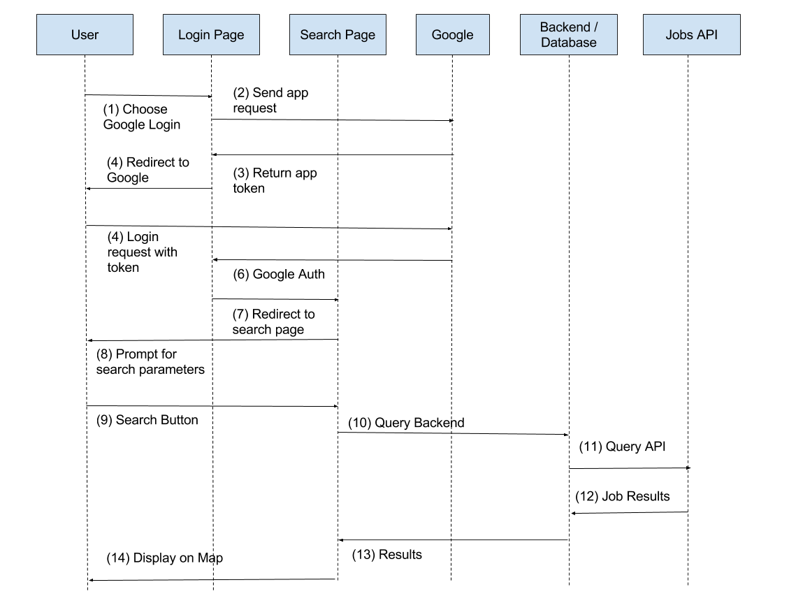

# Architecture

## User Story
Login to site, do a search for technology jobs in Texas with cost of living $500-$1,000 per month.

## Happy Path
1. User navigates to login page
2. User logs in using Google Account
  - Success: Redirect to search page
  - Failure: Display error, prompt to try again
3. User inputs search parameters, clicks Search button
  - Invalid parameters: Prompt user to change
4. Query backend / APIs, compile results and display on map
  - API / Backend unavailable, display an error

## Frameworks
- Frontend: React
- Backend: Django 
- Database: SQLLite
